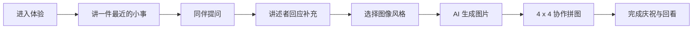
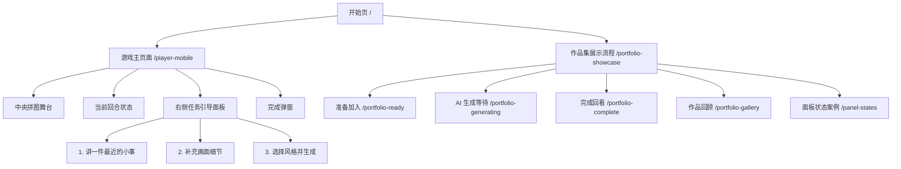

# 语音故事拼图项目 UI 手册与项目说明

## 1. 项目概述

**项目名称**：语音故事拼图 / Story Puzzle  
**项目类型**：轻社交互动体验、共享屏幕游戏、AI 辅助叙事原型  
**核心场景**：多人围绕一块共享屏幕或 iPad，轮流讲述生活中的小故事，由同伴以低压力的方式补充问题，AI 将故事生成图像，再由所有人协作完成 4 x 4 拼图。

本项目关注的是“降低社交压力的共同表达”。用户不需要一开始就讲出完整、漂亮、逻辑严密的故事，只需要说一件最近发生的小事。系统通过语音输入、同伴提问、AI 图像生成和协作拼图，把个人表达转化为可见、可玩、可被共同完成的图像记忆。

## 2. 设计目标

1. **降低表达门槛**  
   用语音替代长文本输入，用固定问题类型替代自由追问，让用户更容易开始表达。

2. **减少被评价感**  
   同伴提问被限制在“画面描述式”和“感受描述式”，避免评价、追问隐私或判断故事好坏。

3. **强化共同完成感**  
   AI 生成图像后，图片被切成 4 x 4 拼图，用户通过轮流移动拼图完成共同任务。

4. **适配共享屏幕**  
   页面采用单屏结构，不再拆分主持人页和玩家页，关键状态集中展示在同一屏幕中。

5. **服务作品集展示**  
   项目同时提供真实可交互页面和状态案例页，便于截图、讲述设计过程和展示组件状态。

## 3. 目标用户与使用场景

### 目标用户

- 害怕破冰、担心说不好的人。
- 需要低压力互动的同学、小组、工作坊参与者。
- 适合教育、心理支持、团队暖场、社交破冰等轻协作场景。

### 使用场景

- 多人围坐在 iPad 或大屏前。
- 当前玩家讲述一件最近发生的小事。
- 同伴通过引导式问题补充画面细节。
- AI 根据故事和补充内容生成图像。
- 大家轮流移动拼图片段，在 3 分钟内完成拼图。

## 4. 核心体验流程

### 流程说明

1. **进入体验**  
   用户从开始页进入游戏，看到项目目标、基本规则和主要行动入口。

2. **分享故事**  
   当前玩家点击“开始说话”，讲一件最近发生的小事，也可以直接输入文字。

3. **同伴提问**  
   同伴从两种提问方式中选择：画面描述式、感受描述式。

4. **讲述者补充**  
   讲述者回答同伴的问题，让画面细节更具体。

5. **选择风格**  
   用户选择治愈风、抽象风、色块风等图像生成风格。

6. **AI 生成图片**  
   系统将故事、同伴补充和风格选择合成为图像 prompt，并生成图片。

7. **协作拼图**  
   图片被切为 4 x 4 拼图，当前玩家在 3 分钟内移动碎片。

8. **完成回看**  
   拼图完成后出现庆祝动画，展示最终图、用时和步数。

## 5. 信息架构

## 6. 页面清单

| 页面 | 路由 | 用途 |
| --- | --- | --- |
| 开始页 | `/#/` | 项目入口，说明体验目标并进入游戏 |
| 游戏主页面 | `/#/player-mobile` | 语音输入、同伴提问、风格选择、AI 生图、拼图 |
| 面板状态案例页 | `/#/panel-states` | 展示任务引导面板的所有关键状态 |
| 作品集展示流程 | `/#/portfolio-showcase` | 作品集版本的页面总览 |
| 准备加入 | `/#/portfolio-ready` | 展示房间与规则进入状态 |
| AI 生成等待 | `/#/portfolio-generating` | 展示等待反馈、关键词和生成进度 |
| 完成回看 | `/#/portfolio-complete` | 展示最终图和共同完成感 |
| 作品回顾 | `/#/portfolio-gallery` | 展示多轮故事图像沉淀 |

## 7. UI 风格定位

### 关键词

- 温和
- 留白
- 低压力
- 轻社交
- 童趣拼图
- 软质卡片
- 明确引导
- 作品集友好

### 风格总结

当前 UI 参考了移动端作品展示类界面的简洁表达：大面积留白、白色卡片、黑色标题、黄色主行动、少量薄荷绿作为完成反馈。整体避免过度装饰，重点突出“当前该做什么”。

视觉语言不追求游戏化的强刺激，而是让用户感到安全、清楚、容易开始。黄色只用于当前最重要的行动，绿色用于完成或进度反馈，黑色用于主标题和关键按钮，灰色用于未解锁和辅助信息。

## 8. 设计原则

### 8.1 单屏优先

所有关键操作尽量保留在一个屏幕内，避免用户在主持人页、玩家页、提问页之间频繁跳转。

### 8.2 当前任务唯一突出

每个阶段只保留一个最明显的主行动：

- 分享阶段：开始说话。
- 提问阶段：同伴语音补充。
- 回应阶段：讲述者补充说明。
- 生成阶段：生成拼图。
- 拼图阶段：移动一块碎片。

### 8.3 低压力文案

避免“请完整描述”“请认真回答”这类有压力的文案，使用更轻的表达：

- “讲一件最近的小事”
- “不用讲完整”
- “先说一个地点、人物或瞬间就可以”
- “问题只补充画面，不评价故事”

### 8.4 状态可见

每一步必须清楚显示状态：

- 进行中
- 录音中
- 已记录
- 待补充
- 未解锁
- 待生成
- 拼图中
- 已完成

## 9. 色彩规范

| Token | 颜色 | 用途 |
| --- | --- | --- |
| `color.text.primary` | `#111111` | 主标题、主按钮、关键数字 |
| `color.text.secondary` | `#6F6F68` | 辅助说明、描述文字 |
| `color.text.muted` | `#AAA99F` | 未激活说明、placeholder |
| `color.surface.base` | `#FFFFFF` | 卡片、面板 |
| `color.surface.soft` | `#FBFBF8` | 输入框、浅层容器 |
| `color.line` | `#ECECE6` | 分割线、描边 |
| `color.primary.yellow` | `#ffd54f` | 当前主行动、进行中状态 |
| `color.success.mint` | `#75E3D5` | 完成、进度、正向反馈 |
| `color.warning.cream` | `#fff2b8` | 轻提示、任务标签 |
| `color.background` | `#F7F7F2` | 页面背景 |

### 使用规则

- 黄色只能用于当前最重要的行动，不用于普通装饰。
- 薄荷绿用于完成态、成功态和拼图进度。
- 黑色用于主标题和高优先级按钮。
- 灰色用于未解锁和辅助说明，但不要让未解锁内容完全不可读。

## 10. 字体与排版

### 字体建议

- 中文：`PingFang SC`、`HarmonyOS Sans SC`、`Source Han Sans`
- 英文：`Inter`、`Manrope`

### 字号建议

| 层级 | 字号 | 用途 |
| --- | --- | --- |
| Display | 40-56px | 作品集展示页大标题 |
| H1 | 28-36px | 页面标题 |
| H2 | 20-24px | 模块标题 |
| H3 | 15-18px | 卡片标题、步骤标题 |
| Body | 13-16px | 正文、说明 |
| Caption | 11-12px | 状态、标签、辅助信息 |

### 排版规则

- 字间距保持 `0`，不要使用负字距。
- 正文行高建议 `1.45-1.7`。
- 标题不宜过长，超过一行时优先换行，不压缩字距。

## 11. 间距、圆角与阴影

### 间距系统

| Token | 值 | 用途 |
| --- | --- | --- |
| `space.1` | 4px | 图标和文字的细小间距 |
| `space.2` | 8px | 标签、按钮内部间距 |
| `space.3` | 12px | 卡片内部小间距 |
| `space.4` | 16px | 面板内边距 |
| `space.5` | 20px | 卡片之间距离 |
| `space.6` | 24px | 页面模块距离 |
| `space.7` | 28px | 页面边距 |

### 圆角

| Token | 值 | 用途 |
| --- | --- | --- |
| `radius.sm` | 8px | 小按钮、小卡片 |
| `radius.md` | 14px | 图标按钮、输入入口 |
| `radius.lg` | 18px | 状态卡、步骤卡 |
| `radius.xl` | 24px | 主面板 |
| `radius.full` | 999px | 标签、pill 按钮 |

### 阴影

- 普通卡片：`0 10px 24px rgba(23, 25, 30, 0.05)`
- 强调卡片：`0 18px 40px rgba(23, 25, 30, 0.10)`
- 大容器：`0 24px 60px rgba(23, 25, 30, 0.09)`

## 12. 核心组件规范

### 12.1 顶部流程条

**用途**：展示完整游戏流程，帮助用户知道当前所处阶段。  
**结构**：步骤编号、阶段名称、预计耗时。  
**状态**：

- 当前步骤：高亮但不抢主舞台注意力。
- 非当前步骤：浅灰文字，降低视觉权重。

### 12.2 当前回合状态栏

**用途**：告诉用户现在轮到谁、当前任务是什么、还剩多少时间。  
**结构**：

- 左侧：头像、玩家名、任务说明。
- 右侧：当前任务标签、倒计时。

**设计重点**：

- 倒计时必须清晰。
- 当前任务必须一眼可见。
- 不和拼图主舞台竞争。

### 12.3 中央拼图舞台

**用途**：游戏主视觉和核心互动区域。  
**结构**：

- 4 x 4 拼图格。
- 未生成时展示轻预览。
- 中央任务卡引导用户完成右侧第 1 步。

**状态**：

- 未生成：轻预览 + 任务卡。
- 拼图中：可点击、可选中、可移动。
- 完成：弹窗庆祝。

### 12.4 任务引导面板

**用途**：承载用户流程的主要操作。  
**结构**：

- 顶部状态卡。
- Step 1：讲一件最近的小事。
- Step 2：补充画面细节。
- Step 3：选择风格并生成拼图。

**状态案例页**：`/#/panel-states`

组件状态包括：

1. Step 1 空状态。
2. Step 1 录音中。
3. 故事已记录。
4. Step 2 同伴提问。
5. Step 3 选择风格。
6. 拼图进行中。

### 12.5 语音按钮

**用途**：降低输入门槛，让用户通过说话参与。  
**状态**：

- 默认：麦克风图标。
- 录音中：停止图标 + 脉冲动画。
- 识别中：禁用或显示识别状态。
- 失败：提示改用文字输入。

**文案**：

- 开始说话
- 停止并识别
- 识别中
- 语音补充
- 回应补充

### 12.6 同伴提问卡

**用途**：让同伴参与，但避免给讲述者造成压力。  
**类型**：

- 画面描述式：问画面中有什么、在哪里、远处是什么。
- 感受描述式：问当时是什么感觉、像什么颜色、希望更安静还是更开心。

**设计规则**：

- 问题只补充画面和感受。
- 不出现评价、质疑、追问隐私的表达。
- 每张卡提供语音入口和 chips 示例。

### 12.7 风格选择卡

**用途**：控制 AI 图像生成方向。  
**当前选项**：

- 治愈风：黑板梦境、星光、远景、柔和但内容丰富。
- 抽象风：情绪形状、色彩流动、低写实。
- 色块风：清晰构图、大色块、适合拼图识别。

**状态**：

- 默认：白底浅描边。
- 选中：黑色描边或明显高亮。
- 未解锁：保持可读，但降低权重。

### 12.8 完成弹窗

**用途**：强化共同完成的成就感。  
**结构**：

- 标题：拼图完成。
- 最终图预览。
- 用时和步数。
- 操作按钮：继续查看、再玩一次。
- 庆祝动画：彩纸散开。

## 13. 组件状态设计

### Step 1 空状态

用户刚进入任务面板，还没有输入故事。  
重点是“让用户开口”，界面提供语音主按钮和 2-3 个轻提示。

### Step 1 录音中

用户正在说话。  
麦克风按钮变为停止状态，顶部状态卡显示“正在记录你的故事”。

### 故事已记录

语音识别完成或用户输入文字。  
展示“已记录”卡片，保留故事文字，避免进入提问后故事内容消失。

### Step 2 同伴提问

同伴选择画面描述式或感受描述式问题。  
强调“只补充，不评价”，让讲述者感到被倾听而不是被审问。

### Step 3 选择风格

讲述者回应补充后，进入风格选择。  
用户选择风格后点击生成拼图。

### 拼图进行中

AI 图像生成成功，进入 4 x 4 拼图。  
显示完成进度、剩余时间和当前玩家任务。

## 14. 文案规范

### 语气

- 温和
- 具体
- 不评判
- 不命令
- 不强调表现好坏

### 推荐文案

- “讲一件最近的小事”
- “不用讲完整，先说一个地点、人物或瞬间就可以”
- “问题只补充画面，不评价故事”
- “回答同伴的问题，让画面更准确”
- “轮到当前玩家移动 1 块碎片”
- “这幅图是大家一起完成的结果”

### 避免文案

- “请完整描述你的故事”
- “请认真回答”
- “你的故事不够清楚”
- “回答错误”
- “失败”

## 15. 动效规范

### 录音动效

- 麦克风按钮轻微 pulse。
- 不使用过度闪烁。
- 录音状态必须可被用户清楚识别。

### 生成等待

- 显示进度、关键词或状态文案。
- 避免只显示空白 loading。

### 拼图反馈

- 选中拼图块时有高亮。
- 移动后进度更新。
- 完成后播放较明显但不刺眼的庆祝动画。

## 16. 技术实现概览

### 前端

- Vue 3
- Vite
- Vue Router
- Vant
- Axios
- Socket.io Client

### 后端

- Node.js
- Express
- Socket.io
- Multer
- Tencent Cloud ASR
- OpenAI Images API
- DashScope / 通义万相 fallback

### 主要接口

- `POST /api/asr`：语音识别。
- `POST /api/story`：故事生图。
- `POST /api/room/create`：创建房间。
- `POST /api/room/join`：加入房间。
- `GET /api/room/:roomCode`：获取房间信息。

### 当前前端重点文件

| 文件 | 作用 |
| --- | --- |
| `frontend/src/views/Stage1/StartPage.vue` | 开始页 |
| `frontend/src/views/Stage1/PlayerMobile.vue` | 核心游戏页面 |
| `frontend/src/views/Stage1/GuidedPanelStates.vue` | 任务面板状态案例页 |
| `frontend/src/views/Stage1/PortfolioShowcase.vue` | 作品集展示总览 |
| `frontend/src/views/Stage1/PortfolioScreen.vue` | 作品集独立展示页 |
| `frontend/src/router/index.js` | 路由配置 |

## 17. 作品集表达建议

### 项目一句话

一个用语音叙事、同伴提问和 AI 生图，把低压力社交互动转化为协作拼图体验的共享屏幕原型。

### 项目亮点

- 将“讲故事”拆成更容易开始的小步骤。
- 通过同伴提问机制降低冷场和尴尬。
- 用 AI 图像生成将抽象表达转化为可见画面。
- 用 4 x 4 拼图把个人故事变成共同完成的任务。
- 提供真实交互页与作品集展示页，便于设计过程表达。

### 可展示内容

- 用户旅程图。
- 双钻设计模型。
- 信息架构图。
- UI 状态案例页。
- 主要游戏界面。
- 完成弹窗。
- Prompt 策略与图像风格控制。
- iPad / 大屏使用场景插画。

## 18. 后续优化方向

1. **组件化重构**  
   将任务引导面板拆分为独立组件，便于复用和维护。

2. **真实多人同步**  
   将当前单屏流程与 Socket.io 房间状态进一步统一。

3. **ASR 体验优化**  
   补充录音失败、识别失败、重新识别、手动编辑等状态。

4. **Prompt 版本管理**  
   为不同风格建立可配置 prompt 模板，便于后续替换模型。

5. **Figma 同步**  
   将前端状态案例页同步为 Figma 组件状态，形成设计系统。

6. **可访问性检查**  
   增加字号、对比度、触控区域、键盘导航和屏幕阅读器标签。

## 19. 本地查看地址

开发服务器启动后，可访问：

- 开始页：`http://127.0.0.1:5173/#/`
- 游戏主页面：`http://127.0.0.1:5173/#/player-mobile`
- 面板状态案例页：`http://127.0.0.1:5173/#/panel-states`
- 作品集展示页：`http://127.0.0.1:5173/#/portfolio-showcase`

